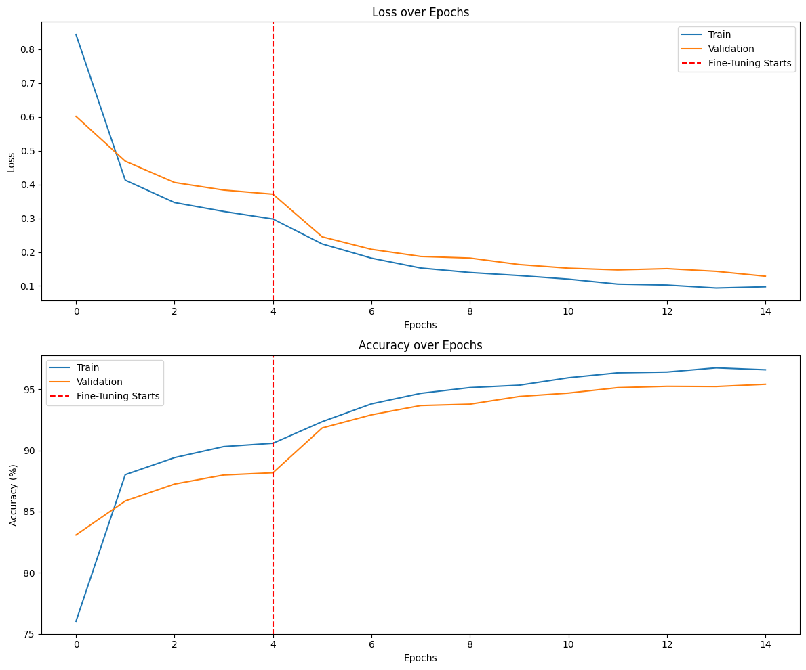
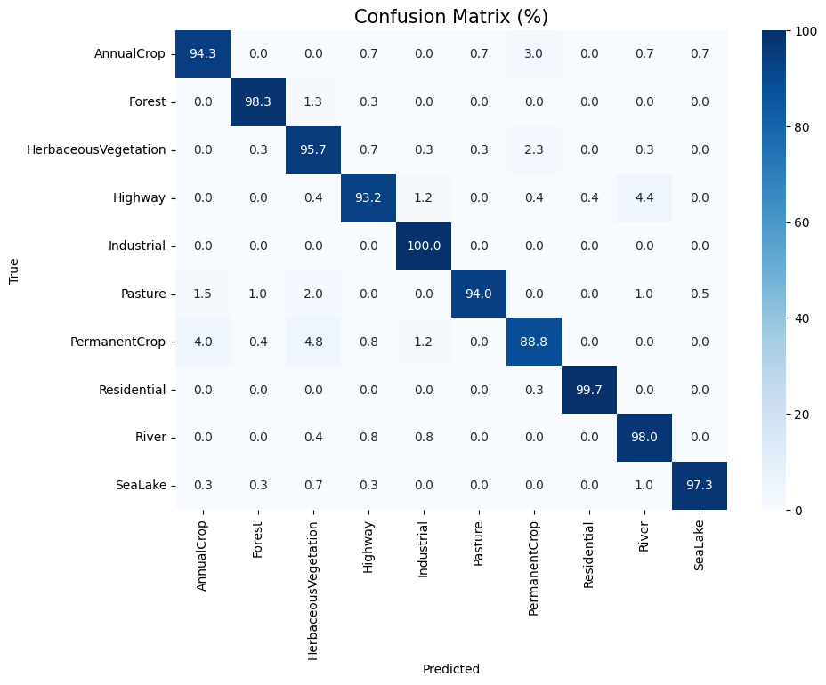

# Land Use Classification of Satellite Imagery using Transfer Learning

**Course:** 
Practical Machine Learning | Master's in Green Data Science (2025-2026)
**Institution:** 
Instituto Superior de Agronomia, ULisboa

**Team:** 
* Catarina Silva (nº 23421)
* João Alexandre (nº 29602)

---

## 1. Introduction
Accurate land-use mapping is essential for environmental monitoring, urban planning, agriculture, and sustainable resource management. This project focuses on the automatic classification of land use and land cover from satellite imagery using deep learning, addressing the slow and costly nature of traditional manual interpretation. 

## 2. Data
* **Dataset:** EuroSAT RGB (approximately 27,000 labelled Sentinel-2 satellite images).
* **Classes:** 10 land-use classes (AnnualCrop, Forest, HerbaceousVegetation, Highway, Industrial, Pasture, PermanentCrop, Residential, River, SeaLake).
* **Transformations:** Images were resized to 224x224 and normalized. Data augmentation techniques (Random Horizontal Flip and Random Rotation) were exclusively applied to the training set to improve variability and model robustness.

## 3. Data Organization
* **Split Ratio:** The dataset was partitioned into training, validation, and test sets using a 70% Train, 20% Validation, and 10% Test split.
* **Batches:** Data was batched and shuffled (for training) using PyTorch `DataLoader` with a batch size of 32.

## 4. Methods
* **Architecture:** Transfer Learning utilizing a pre-trained ResNet18 model implemented in PyTorch.
* **Phase 1 (Feature Extraction):** All convolutional layers were frozen; only the final classification layer (modified for ten outputs) was trained (Epochs: 5, Learning Rate: 1e-3).
* **Phase 2 (Fine-Tuning):** The final residual block (`layer4`) was unfrozen and fine-tuned using a smaller learning rate to better adapt high-level features to satellite imagery (Epochs: 10, Learning Rate: 1e-4).
* **Loss Function:** CrossEntropyLoss.
* **Optimizer:** SGD with momentum.

## 5. Results
* **Test Accuracy:** ~95.4%
* **Macro F1-Score:** ~0.95

### Training and Validation Metrics

### Confusion Matrix

## 6. Analysis
The model demonstrates strong convergence with stable learning and limited overfitting, overcoming the initial challenges. Classes such as Forest, Residential, and SeaLake achieved very high precision and recall (97-99%). The majority of misclassifications occurred between visually and spectrally similar land-cover categories, namely HerbaceousVegetation, Pasture, and PermanentCrop.

## 7. Deployment
To demonstrate the practical application of this model for environmental monitoring, we developed an interactive web application. Users can upload unseen Sentinel-2 satellite imagery, and the model will instantly predict the land cover class with confidence percentages.

* **Live Application:** https://huggingface.co/spaces/joaoalexandre14/eurosat-land-classification

## 8. References
* The geo-referenced dataset EuroSAT is made publicly available here: https://www.kaggle.com/datasets/waseemalastal/eurosat-rgb-dataset

## 9. Contributions 
Catarina Silva: Data preparation, model development, experimentation, and 
documentation 
João Alexandre: Deployment implementation, experimentation, result analysis, and 
documentation
